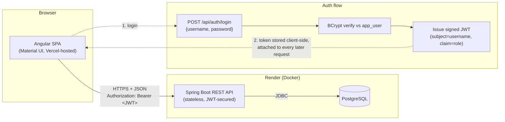
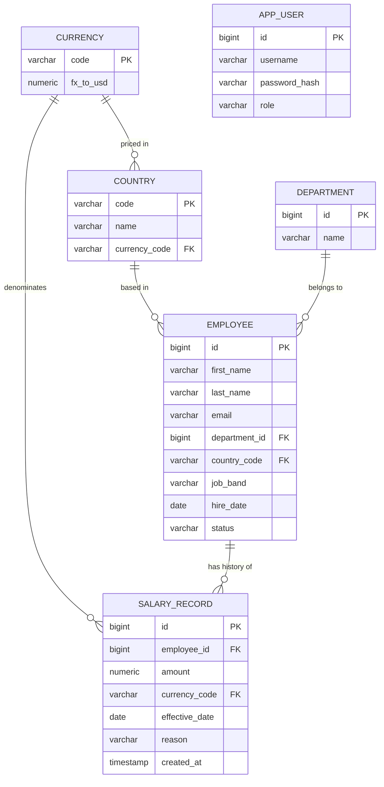

# Architecture Notes

## Stack

| Layer      | Choice                                             | Why |
|------------|-----------------------------------------------------|-----|
| Backend    | Java 17, Spring Boot 4, Maven                        | Matches the target JD (Java/Spring craftsperson role); Spring Boot 4 was current stable at build time |
| DB         | PostgreSQL (prod), H2 in file/PostgreSQL-mode (dev), H2 in-memory (tests) | Relational, handles 10k-row aggregation well; H2 keeps local dev and tests fast/hermetic without requiring a local Postgres install |
| Migrations | Flyway                                              | Versioned schema = readable history of data-model evolution |
| Auth       | Spring Security + JWT (jjwt)                        | Single-role login, stateless, no session store needed |
| Frontend   | Angular 22 (standalone components, esbuild builder) + Angular Material | Matches JD; Material gives production-grade table/form/dialog components out of the box |
| Charts     | ngx-charts                                          | Lightweight, no heavy dependency for a handful of dashboard charts |
| Deploy     | Render (backend + Postgres), Vercel (Angular static build) | Both have workable free tiers for a demo deployment |

## System architecture

The frontend never talks to the database directly and holds no
long-lived server session — every request after login carries the JWT,
verified statelessly on each call. This is what makes the backend safe to
scale/restart without a shared session store, and is why there's no
server-side "logout" endpoint: logging out is just the client discarding
its token.

## Domain model

`SalaryRecord` is **append-only**: giving a raise inserts a new row with a
later `effective_date`; it never updates a prior row. "Current salary" is
defined as the record with the latest `effective_date <= now()` per
employee. This is what makes salary history and the audit trail trustworthy,
and lets analytics simply be "aggregate the current record per employee."

`job_band` is a simple enum-like string (e.g. `L1`..`L6`) rather than a
separate table — it doesn't need its own attributes beyond a label, so a
join table would be premature. `AppUser` has no foreign keys to the rest
of the schema on purpose: it's an operator account for the tool, not part
of the org data being managed.

## API shape (indicative)

- `POST /api/auth/login` → JWT
- `GET /api/employees?search=&department=&country=&band=&page=&size=&sort=` → paginated,
  sortable directory. `sort` accepts any Employee column (including nested
  ones like `department.name`) plus the synthetic `currentSalaryAmount`,
  which is resolved via a correlated subquery rather than a plain column
  since salary lives in `salary_record`, not `employee`.
- `GET /api/employees/{id}` → profile + current salary, including a
  `belowBandAverage` flag (paid >15% under their job band's org-wide
  average) as a basic pay-equity signal
- `GET /api/employees/{id}/salary-history` → ordered list of SalaryRecord
- `POST /api/employees/{id}/salary-adjustments` → append a SalaryRecord
- `GET /api/analytics/summary` → headcount/payroll by dept & country, band pay ranges, currency-normalized totals
- `GET /api/analytics/recent-changes?limit=` → last N salary adjustments org-wide, newest first
- `GET /api/employees/export` → CSV of current filtered view
- `GET /api/reference/departments`, `GET /api/reference/countries` → lookups for the UI's filter dropdowns

All endpoints except `/api/auth/login` require a valid JWT.

## Performance approach at 10k employees

Short version: nothing pulls all 10k rows into application memory to
filter/aggregate them in Java — SQL does that work. See
`docs/performance.md` for the specific query patterns and measured
numbers (seed time, analytics latency, export latency).

## Testing strategy

Coverage, measured (not estimated): backend 98.8% lines / 87.8% branches
via JaCoCo (`mvn test`, report at `backend/target/site/jacoco/index.html`);
frontend 97.9% lines / 93.0% branches / 96.7% statements via Vitest's V8
coverage (`ng test -- --coverage`). Remaining gaps on the backend are a
handful of unused entity accessors (e.g. `AppUser.getCreatedAt()`) kept
for API completeness rather than stripped to chase 100%, plus Spring's
`main()` boilerplate; on the frontend, non-logic files (`*.model.ts`,
`app.config.ts`, `app.routes.ts`) are excluded from the coverage target
since they're declarative, not tested behavior.

- **Pure unit tests** (JUnit 5, no Spring context): `JwtServiceTest`
  covers token issue/parse/expiry/tamper-rejection in isolation — fast,
  no DB, no HTTP.
- **Backend integration tests** (`@SpringBootTest` + MockMvc + H2, one
  suite per feature): auth flow, directory search/filter/pagination,
  salary-adjustment business rules (backdating, pre-hire dates,
  terminated employees), analytics aggregation math against a known
  fixture, CSV export, reference-data lookups. These exercise the real
  Spring wiring and real SQL (H2 in PostgreSQL-compatibility mode)
  end-to-end through the actual HTTP layer, which is where most of the
  business rules in this app actually live.
- **Repository-level test** (`@DataJpaTest`): `EmployeeRepositoryTest`
  verifies the `Specification` filter and the eager-fetch detail query
  directly against the Flyway-migrated schema.
- **Frontend unit tests** (Angular's default Vitest runner +
  `HttpClientTestingModule`): auth session persistence, the HTTP
  interceptor's token-attach/401-redirect behavior, the route guard,
  directory filter → query-param mapping, the salary-adjustment dialog's
  validation/success/error paths, and the login flow — each isolated
  from a real backend via mocked HTTP.

## What was deliberately kept simple

- One JWT role, no refresh-token rotation or password-reset flow — there's
  a single known HR Manager user, not a self-serve user base.
- Fixed FX snapshot table instead of a live-rates integration (see
  `requirements.md` for the reasoning).
- No caching layer (e.g. Redis) — at 10k rows, well-indexed Postgres
  queries are fast enough that a cache would be premature complexity for
  this exercise.
